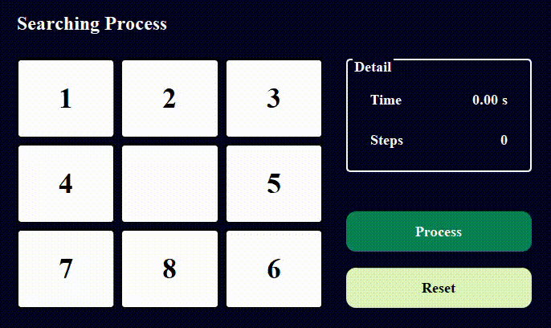
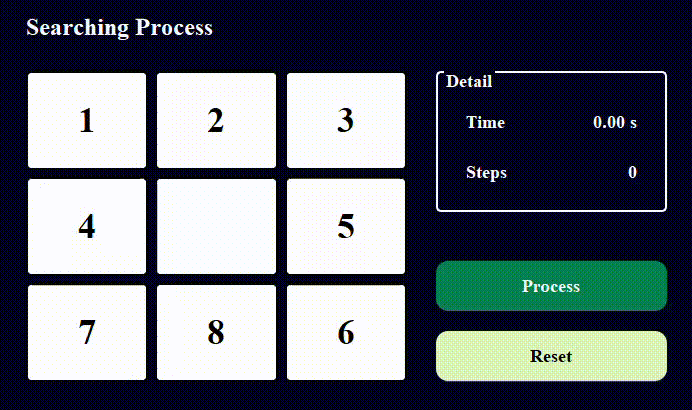
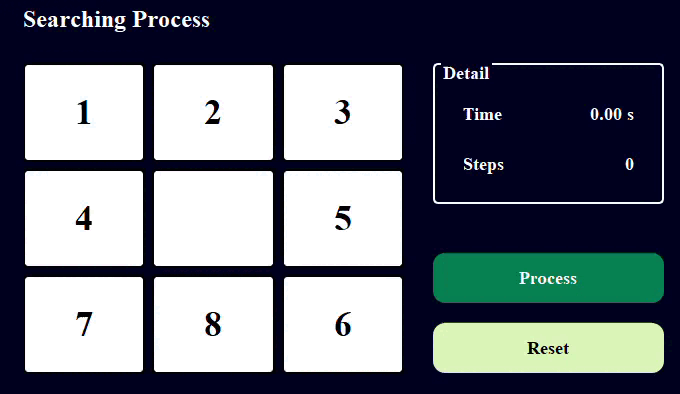
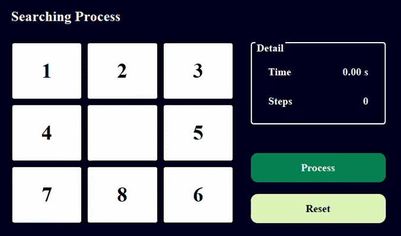
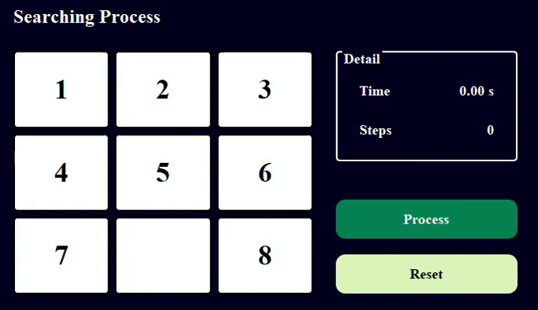
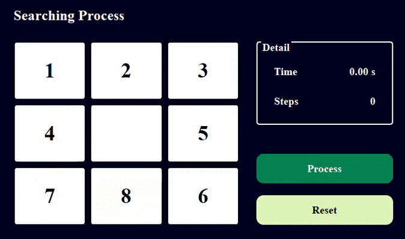
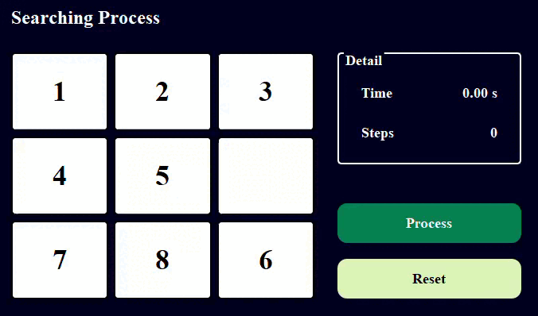
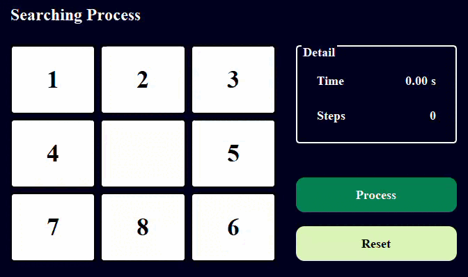
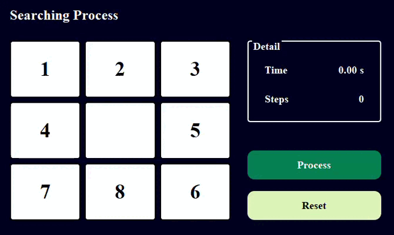

# TTNT_PersonalProject

## Sinh viên thực hiện:
**Họ tên:** Uý Nữ Kiều Linh

**Mssv:** 21110896

**Khoa:** Công nghệ thông tin

**Trường:** Đại học Sư phạm Kỹ thuật Thành phố Hồ Chí Minh
 
## 1.	Mục tiêu:
    Mục tiêu của dự án là:
    - Nắm vững kiến thức cơ bản về các thuật toán tìm kiếm thông qua môn học Trí tuệ Nhân tạo.  
    - Hiểu rõ cách thức hoạt động của các thuật toán này và cách áp dụng chúng vào bài toán thực tế 8-puzzle.  
    - Rèn luyện kỹ năng phân tích bài toán, thiết kế giải pháp tối ưu, lập trình hiệu quả, và sửa lỗi.  
    - Tạo nền tảng để áp dụng kiến thức vào việc giải quyết các bài toán phức tạp hơn trong tương lai.  

    Thuật toán tìm kiếm bao gồm các nhóm sau:
    - Uniformed Search: 
        Breadth-First Search (BFS)
        Depth-First Search (DFS)
        Uniform Cost Search (UCS)
        Iterative Deepening Search (IDS)
    - Informed Search: 
        Greedy Search
        A* Search
        Iterative Deepening A* (IDA*)
    - Local Search: 
        Simple Hill Climbing
        Steepest-Ascent Hill Climbing
        Stochastic Hill Climbing
        Simulated Annealing (SA)
        Genetic Algorithm (GA)
    - Complex Environment: 
        And-Or Search, 
        Belief State Search
        Searching with Partial Observation
    - Constraint Satisfaction Problems (CSPS): 
        Backtracking
        Backtracking With Forward Checking
    - Reinforcement Learning: 
        Q-Learning

## 2. Nội dung
### 2.1. Các thuật toán Tìm kiếm không có thông tin
#### 2.1.1 Thành phần chính của bài toán tìm kiếm
    -	Trạng thái khởi đầu (Start State): Trạng thái ban đầu từ đó bắt đầu tìm kiếm.
    -	Trạng thái đích (Goal State): Trạng thái cần đạt được để giải bài toán.
    -	Không gian trạng thái (State Space): Tập hợp tất cả các trạng thái có thể có của bài toán.
    -	Chi phí (Cost): Chi phí của mỗi bước di chuyển. (Có thể là cố định (BFS, DFS, IDS) hoặc thay đổi (UCS)).
    -	Cấu trúc dữ liệu: Dùng để quản lý các trạng thái cần mở rộng:
        o	Hàng đợi (BFS).
        o	Ngăn xếp (DFS, IDS).
        o	Hàng đợi ưu tiên (UCS).
    -	Đường đi (Path): Một chuỗi các trạng thái từ trạng thái khởi đầu đến trạng thái đích.
#### 2.1.2. Hình ảnh gif của từng thuật toán khi áp dụng lên trò chơi 

|  |  |  |  |
|----------------------------|----------------------------|----------------------------|----------------------------|
| **Thuật toán BFS**                  | **Thuật toán DFS**                  | **Thuật toán UCS**                  | **Thuật toán IDS**                  |
#### 2.1.3. Nhận xét về hiệu suất của các thuật toán khi áp dụng lên trò chơi 8 ô chữ  

| Thuật toán | Tính đầy đủ | Tối ưu | Thời gian | Không gian	 | Nhận xét |
|-------|-------|-------|-------|-------|-------|
| BFS | Có | Có | $O(b^d)$ | $O(b^d)$ | Bộ nhớ tốn kém, nhưng đảm bảo |
| DFS | Không | Không | $O(b^m)$ | $O(bm)$ | Nhanh, nhưng dễ bị lặp hoặc lạc |
| UCS | Có | Có | $O(b^d)$ | $O(b^d)$ | Tốt khi chi phí bước không đều |
| IDS | Có | Có | $O(b^d)$ | $O(bd)$ | 	Hiệu quả hơn BFS về bộ nhớ |

### 2.2. Các thuật toán Tìm kiếm có thông tin
#### 2.2.1 Thành phần chính của bài toán tìm kiếm
    -	Trạng thái khởi đầu (Start State): Trạng thái ban đầu từ đó bắt đầu tìm kiếm.
    -	Trạng thái đích (Goal State): Trạng thái cần đạt được để giải bài toán.
    -	Không gian trạng thái (State Space): Tập hợp tất cả các trạng thái có thể có của bài toán.
    -	Chi phí (Cost): Chi phí của mỗi bước di chuyển. 
    -	Hàm heuristic: Hàm ước lượng chi phí còn lại để đạt được trạng thái đích.
    -	Đường đi (Path): Một chuỗi các trạng thái từ trạng thái khởi đầu đến trạng thái đích.
#### 2.2.2. Hình ảnh gif của từng thuật toán khi áp dụng lên trò chơi 

|  |  | |
|----------------------------|----------------------------|----------------------------|
| **Thuật toán Greedy Search**                  | **Thuật toán A***                  | **Thuật toán IDA***                  | 
#### 2.2.3. Nhận xét về hiệu suất của các thuật toán khi áp dụng lên trò chơi 8 ô chữ  

| Thuật toán | Tính đầy đủ | Tối ưu | Thời gian | Không gian	 | Nhận xét |
|-------|-------|-------|-------|-------|-------|
| Greedy Search | Không | Không | $O(b^m)$ | $O(b^m)$ | Chạy nhanh với heuristic tốt nhưng không đảm bảo tìm lời giải tối ưu |
| A* | Có | Có | $O(b^d)$ | $O(b^d)$ | Tìm lời giải tối ưu nhưng tiêu tốn nhiều bộ nhớ |
| IDA* | Có | Có | $k \cdot O(b^d)$ | $O(d)$ | Tối ưu về không gian nhưng thời gian có thể lớn hơn A* |

### 2.3. Các thuật toán Tìm kiếm cục bộ
#### 2.3.1 Thành phần chính của bài toán tìm kiếm
    -	Trạng thái khởi đầu (Start State): Trạng thái ban đầu từ đó bắt đầu tìm kiếm.
    -	Trạng thái đích (Goal State): Trạng thái cần đạt được để giải bài toán.
    -	Không gian trạng thái (State Space): Tập hợp tất cả các trạng thái có thể có của bài toán.
    -	Chi phí (Cost): Chi phí của mỗi bước di chuyển. 
    -	Hàm heuristic: Hàm đánh giá sự "tốt" của trạng thái, giúp chọn lựa bước đi tiếp theo.
    -	Đường đi (Path): Chuỗi các trạng thái từ trạng thái khởi đầu đến trạng thái đích (Không áp dụng cho thuật toán Genetic Algorithm).
#### 2.3.2. Hình ảnh gif của từng thuật toán khi áp dụng lên trò chơi 

|  |  | | | |
|----------------------------|----------------------------|----------------------------|----------------------------|----------------------------|
| **Thuật toán Simple Hill Climbing**                  | **Thuật toán Steepest-Ascent Hill Climbing**                  | **Thuật toán Stochastic Hill Climbing**                  | **Thuật toán Simulated Annealing**                  | **Thuật toán Genetic Algorithm**                  | 
#### 2.3.3. Nhận xét về hiệu suất của các thuật toán khi áp dụng lên trò chơi 8 ô chữ  

| Thuật toán | Tính đầy đủ | Tối ưu | Thời gian | Không gian	 | Nhận xét |
|-------|-------|-------|-------|-------|-------|
| Simple Hill Climbing | Không (mắc kẹt tại cực trị cục bộ) | Không | $O(bd)$ | $O(1)$ | Dễ triển khai nhưng dễ bị mắc kẹt ở cực trị cục bộ |
| Steepest-Ascent Hill Climbing | Không (mắc kẹt tại cực trị cục bộ) | Không | $O(bd)$ | $O(1)$ | Hiệu quả hơn Simple Hill Climbing, nhưng vẫn dễ bị mắc kẹt |
| Stochastic Hill Climbing | Có thể (nhờ tính ngẫu nhiên) | Không | $O(kd)$ | $O(1)$ | Có thể thoát khỏi cực trị cục bộ nhưng không đảm bảo tìm được tối ưu toàn cục |
| Simulated Annealing | Có (với lịch giảm nhiệt phù hợp) | Có (với lịch giảm nhiệt chậm) | $O(bd)$ | $O(1)$ | Hiệu quả trong việc tránh cực trị cục bộ; yêu cầu điều chỉnh lịch giảm nhiệt |
| Genetic Algorithm | Có (với quần thể và số thế hệ đủ lớn) | Có (với quần thể lớn) | $O(pgf)$ | $O(p)$ | Tìm kiếm mạnh mẽ, không dễ mắc kẹt, nhưng đòi hỏi nhiều tài nguyên và thời gian |

### 2.4. Các thuật toán Tìm kiếm trong môi trường phức tạp
#### 2.4.1 Thành phần chính của bài toán tìm kiếm
    -	Trạng thái khởi đầu (Start State): Trạng thái ban đầu từ đó bắt đầu tìm kiếm.
    -	Trạng thái đích (Goal State): Trạng thái cần đạt được để giải bài toán.
    -	Không gian trạng thái (State Space): Tập hợp tất cả các trạng thái có thể xảy ra trong quá trình tìm kiếm, bao gồm cả các trạng thái quan sát toàn phần hoặc một phần (partial observation).
    -	Chi phí (Cost): Chi phí g(n) cho mỗi bước di chuyển từ trạng thái khởi đầu đến trạng thái hiện tại (Một số thuật toán, như And-Or Search, không sử dụng chi phí này mà chỉ tập trung vào việc tìm kiếm đường đi khả thi).
    -	Hàm heuristic: Hàm đánh giá sự "tốt" của một trạng thái, giúp định hướng việc chọn lựa trạng thái kế tiếp. Với trạng thái quan sát một phần, hàm heuristic được tính dựa trên phần trạng thái hiện có.
    -	Đường đi (Path): Chuỗi các trạng thái từ trạng thái khởi đầu đến trạng thái đích (Không áp dụng cho thuật toán Genetic Algorithm).
#### 2.4.2. Hình ảnh gif của từng thuật toán khi áp dụng lên trò chơi 

|  |  |
|----------------------------|----------------------------|
| **Thuật toán And-Or Search**                  | **Thuật toán Partial Observation**                  |
#### 2.4.3. Nhận xét về hiệu suất của các thuật toán khi áp dụng lên trò chơi 8 ô chữ  

| Thuật toán | Tính đầy đủ | Tối ưu | Thời gian | Không gian	 | Nhận xét |
|-------|-------|-------|-------|-------|-------|
| And-Or Search | Có (nếu không gian trạng thái hữu hạn và không có nút bế tắc) | Không | $O(b^m)$ | $O(b \cdot m)$ | Phù hợp với các bài toán có nhiều cách giải, trả về một kế hoạch hợp lệ thay vì đường đi tối ưu. Dễ gặp vấn đề với các trạng thái lặp hoặc bế tắc. |
| Partial Observation | Có (nếu hàm heuristic tốt và trạng thái quan sát đủ chính xác) | Có (với heuristic tốt) | $O(b^d)$ (trong trường hợp tốt) | $O(b^d)$ | Giải quyết tốt bài toán với thông tin không đầy đủ, nhưng độ chính xác phụ thuộc vào hàm heuristic và chiến lược quan sát một phần trạng thái. |

### 2.5. Các thuật toán Tìm kiếm thỏa mãn ràng buộc
#### 2.5.1 Thành phần chính của bài toán tìm kiếm
    -	Trạng thái khởi đầu (Start State): Trạng thái ban đầu từ đó bắt đầu tìm kiếm.
    -	Trạng thái đích (Goal State): Trạng thái cần đạt được để giải bài toán.
    -	Không gian trạng thái (State Space): Tập hợp tất cả các trạng thái có thể xảy ra trong quá trình tìm kiếm. Bao gồm các trạng thái được sinh ra từ các di chuyển hợp lệ và kiểm tra tính nhất quán.
    -	Hàm heuristic: Hàm đánh giá mức độ "tốt" của một trạng thái để định hướng lựa chọn trạng thái tiếp theo. Với Backtracking, hàm heuristic thường đơn giản hoặc không dùng; với Forward Checking, hàm này có thể dựa trên số lượng ràng buộc thỏa mãn hoặc số ô đã được đặt đúng.
    -	Đường đi (Path): Chuỗi các trạng thái từ trạng thái khởi đầu đến trạng thái đích.
#### 2.5.2. Hình ảnh gif của từng thuật toán khi áp dụng lên trò chơi 

|  |  |
|----------------------------|----------------------------|
| **Thuật toán Backtracking**                  | **Thuật toán Backtracking With Forward Checking**                  |
#### 2.5.3. Nhận xét về hiệu suất của các thuật toán khi áp dụng lên trò chơi 8 ô chữ  

| Thuật toán | Tính đầy đủ | Tối ưu | Thời gian | Không gian	 | Nhận xét |
|-------|-------|-------|-------|-------|-------|
| Backtracking | Có (nếu không gian trạng thái hữu hạn) | Không | $O(b^m)$ | $O(m)$ | Phù hợp với các bài toán có nhiều cách giải, trả về một kế hoạch hợp lệ thay vì tối ưu. Dễ gặp trạng thái lặp hoặc bế tắc. |
| Backtracking With Forward Checking | Có (nếu hàm kiểm tra trước loại trừ được trạng thái không hợp lệ) | Không (trừ khi tích hợp heuristic tốt) | $O(b^m)$ |  $O(b \cdot m)$ | Giảm số lượng trạng thái cần duyệt nhờ kiểm tra trước. Phù hợp hơn với bài toán có ràng buộc mạnh. |

### 2.6. Các thuật toán Tìm kiếm học tăng cường
#### 2.6.1 Thành phần chính của bài toán tìm kiếm
    -	Trạng thái khởi đầu (Start State): Trạng thái ban đầu từ đó bắt đầu tìm kiếm.
    -	Trạng thái đích (Goal State): Trạng thái cần đạt được để giải bài toán.
    -	Không gian trạng thái (State Space): Tập hợp tất cả các trạng thái có thể xảy ra trong quá trình tìm kiếm, bao gồm các trạng thái được sinh ra từ các hành động hợp lệ và các trạng thái trung gian.
    -	Hàm heuristic: Trong thuật toán Q-Learning, giá trị Q (Q-value) đóng vai trò định hướng lựa chọn hành động tốt nhất. Giá trị Q được cập nhật dựa trên phần thưởng nhận được và giá trị Q của trạng thái kế tiếp.
    -	Đường đi (Path): Chuỗi các trạng thái từ trạng thái khởi đầu đến trạng thái đích, được tái tạo dựa trên Q-table sau khi thuật toán học xong.
#### 2.6.2. Hình ảnh gif của từng thuật toán khi áp dụng lên trò chơi 

|  |
|----------------------------|
| **Thuật toán Q - Learning**                  | 

## 3. Kết luận
Qua quá trình thực hiện dự án, đã đạt được các kết quả sau:
- Hiểu rõ các thuật toán tìm kiếm và triển khai được, thể hiện hiệu quả trên trò chơi 8 ô chữ.
- Đã so sánh các thuật toán từ đó đưa ra lựa chọn tối ưu cho từng tình huống.
- Sử dụng GIF minh họa giúp dễ dàng theo dõi và phân tích các thuật toán.
- Dự án nâng cao kỹ năng lập trình và khả năng áp dụng thuật toán vào thực tiễn, giúp hiểu sâu về trí tuệ nhân tạo và các nguyên lý cơ bản, mở ra cơ hội cho các dự án tương lai.
