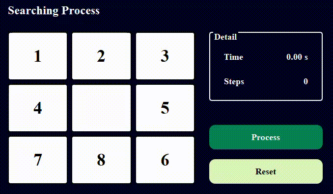

# TTNT_PersonalProject
 
## 1.	Mục tiêu:
    Mục tiêu của dự án là giúp nắm vững kiến thức cơ bản về các thuật toán tìm kiếm thông qua môn học Trí tuệ Nhân tạo. Dự án cũng nhằm mục đích giúp hiểu rõ cách thức hoạt động của các thuật toán này và cách áp dụng chúng vào bài toán thực tế 8-puzzle. Thông qua quá trình thực hiện, sẽ rèn luyện kỹ năng phân tích bài toán, thiết kế giải pháp tối ưu, nâng cao khả năng lập trình, và cải thiện kỹ năng phát hiện cũng như sửa chữa lỗi. Từ đó, tạo nền tảng vững chắc để có thể áp dụng những kiến thức này vào việc giải quyết các bài toán phức tạp hơn trong tương lai.

    Thuật toán tìm kiếm bao gồm các nhóm sau:
    - Uniformed Search: Breadth-First Search (BFS), Depth-First Search (DFS), Uniform Cost Search (UCS), Iterative Deepening Search (IDS)
    - Informed Search: Greedy Search, A* Search, Iterative Deepening A* (IDA*)
    - Local Search: Simple Hill Climbing, Steepest-Ascent Hill Climbing, Stochastic Hill Climbing, Simulated Annealing (SA), Genetic Algorithm (GA)
    - Complex Environment: And-Or Search, Belief State Search, Searching with Partial Observation
    - Constraint Satisfaction Problems (CSPS): Backtracking, Backtracking With Forward Checking
    - Reinforcement Learning: Q-Learning, Deep Q Network (DQN), SARSA (State-Action-Reward-State-Action), Policy-Gradient

## 2. Nội dung
### 2.1. Các thuật toán Tìm kiếm không có thông tin
#### 2.1.1 Thành phần chính của bài toán tìm kiếm
    -	Trạng thái khởi đầu (Start State): Trạng thái ban đầu từ đó bắt đầu tìm kiếm.
    -	Trạng thái đích (Goal State): Trạng thái cần đạt được để giải bài toán.
    -	Không gian trạng thái (State Space): Tập hợp tất cả các trạng thái có thể đạt được từ trạng thái khởi đầu.
    -	Chi phí (Cost): Giá trị đại diện cho chi phí của mỗi bước di chuyển. (Có thể là cố định (BFS, DFS, IDS) hoặc thay đổi (UCS)).
    -	Cấu trúc dữ liệu: Dùng để quản lý các trạng thái cần mở rộng:
        o	Hàng đợi (BFS).
        o	Ngăn xếp (DFS, IDS).
        o	Hàng đợi ưu tiên (UCS).
    -	Đường đi (Path): Một chuỗi các trạng thái từ trạng thái khởi đầu đến trạng thái đích.

#### 2.1.2. Hình ảnh gif của từng thuật toán khi áp dụng lên trò chơi 

|  |  |  |  |
|----------------------------|----------------------------|----------------------------|----------------------------|
| **Thuật toán BFS**                  | **Thuật toán DFS**                  | **Thuật toán UCS**                  | **Thuật toán IDS**                  |